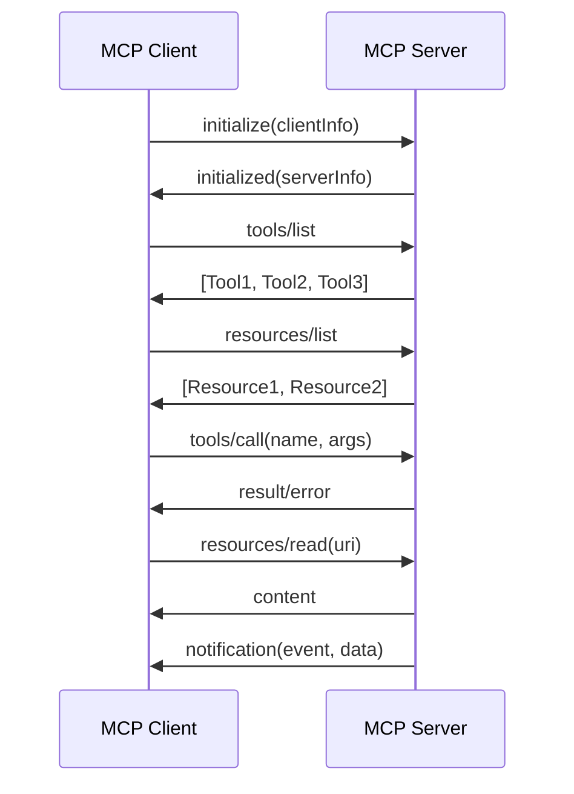

# MCP (Model Context Protocol) - Complete Technical Flowchart

## Overview
Model Context Protocol (MCP) is a standardized protocol for AI assistants to securely connect to external data sources and tools. It enables LLMs to interact with external systems while maintaining security and modularity.

## Core Architecture

```mermaid
graph TD
    A["🤖 MCP: Model Context Protocol"] --> B["Technical Foundation"]
    A --> C["Architecture Components"] 
    A --> D["Data Flow & Communication"]
    A --> E["Implementation Details"]
    A --> F["Security & Privacy"]
    A --> G["Use Cases & Applications"]

    B --> B1["JSON-RPC 2.0 Protocol"]
    B --> B2["Bidirectional Communication"]
    B --> B3["Transport Agnostic"]
    B --> B4["Schema-Based Validation"]
    
    B1 --> B1a["Request/Response Pattern"]
    B1 --> B1b["Notification Messages"]
    B1 --> B1c["Error Handling"]
    
    B2 --> B2a["Client ↔ Server Communication"]
    B2 --> B2b["Event-Driven Architecture"]
    B2 --> B2c["Real-time Bidirectional Flow"]
    
    B3 --> B3a["HTTP/HTTPS"]
    B3 --> B3b["WebSockets"]
    B3 --> B3c["Unix Domain Sockets"]
    B3 --> B3d["Named Pipes"]

    C --> C1["MCP Client"]
    C --> C2["MCP Server"]
    C --> C3["Transport Layer"]
    C --> C4["Resource Management"]
    
    C1 --> C1a["AI Assistant/LLM"]
    C1 --> C1b["Request Orchestration"]
    C1 --> C1c["Response Processing"]
    C1 --> C1d["Session Management"]
    
    C2 --> C2a["Tool Providers"]
    C2 --> C2b["Resource Providers"]
    C2 --> C2c["Context Managers"]
    C2 --> C2d["Capability Discovery"]
    
    C3 --> C3a["Protocol Translation"]
    C3 --> C3b["Connection Management"]
    C3 --> C3c["Message Serialization"]
    
    C4 --> C4a["Resource Discovery"]
    C4 --> C4b["Access Control"]
    C4 --> C4c["State Management"]
```



## 1. Technical Foundation

### JSON-RPC 2.0 Protocol
- **Base Protocol**: All MCP communication uses JSON-RPC 2.0
- **Message Structure**:
  ```json
  {
    "jsonrpc": "2.0",
    "method": "tools/call",
    "params": {
      "name": "file_read",
      "arguments": {"path": "/etc/hosts"}
    },
    "id": 1
  }
  ```

### Bidirectional Communication
- **Client-Initiated**: Traditional request/response
- **Server-Initiated**: Notifications and updates
- **Event-Driven**: Real-time updates about resource changes

### Transport Layer Options
1. **HTTP/HTTPS**: Standard web transport
2. **WebSockets**: Real-time bidirectional
3. **Unix Domain Sockets**: Local inter-process communication
4. **Named Pipes**: Windows inter-process communication

## 2. Architecture Components

### MCP Client (AI Assistant)
```typescript
interface MCPClient {
  connect(transport: Transport): Promise<Connection>
  listTools(): Promise<Tool[]>
  callTool(name: string, args: any): Promise<any>
  listResources(): Promise<Resource[]>
  readResource(uri: string): Promise<ResourceContent>
  subscribe(event: string, callback: Function): void
}
```

### MCP Server (Tool/Resource Provider)
```typescript
interface MCPServer {
  registerTool(tool: ToolDefinition): void
  registerResource(resource: ResourceDefinition): void
  handleRequest(request: JSONRPCRequest): Promise<JSONRPCResponse>
  sendNotification(method: string, params: any): void
  start(transport: Transport): Promise<void>
}
```

### Key Data Structures
```typescript
// Tool Definition
interface Tool {
  name: string
  description: string
  inputSchema: JSONSchema
  outputSchema?: JSONSchema
}

// Resource Definition
interface Resource {
  uri: string
  name: string
  description: string
  mimeType: string
  metadata?: Record<string, any>
}

// Message Envelope
interface MCPMessage {
  jsonrpc: "2.0"
  method: string
  params?: any
  id?: string | number
}
```

## 3. Protocol Flow



## 4. Core Message Types

### Connection Management
- `initialize` - Establish connection with capabilities
- `initialized` - Confirm connection establishment
- `ping` - Connection health check
- `pong` - Health check response

### Tool Operations
- `tools/list` - Enumerate available tools
- `tools/call` - Execute a specific tool
- `tools/get_schema` - Get detailed tool schema

### Resource Operations
- `resources/list` - List available resources
- `resources/read` - Read resource content
- `resources/subscribe` - Subscribe to resource changes
- `resources/unsubscribe` - Unsubscribe from updates

### Notifications
- `notifications/resources/list_changed` - Resource list updated
- `notifications/resources/updated` - Resource content changed
- `notifications/tools/list_changed` - Tool list updated

## 5. Implementation Patterns

### Synchronous Tools
```python
@mcp_tool("file_read")
def read_file(path: str) -> str:
    """Read contents of a file"""
    with open(path, 'r') as f:
        return f.read()
```

### Asynchronous Operations
```python
@mcp_tool("database_query")
async def query_database(sql: str) -> List[Dict]:
    """Execute SQL query"""
    async with db_pool.acquire() as conn:
        return await conn.fetch(sql)
```

### Streaming Responses
```python
@mcp_tool("log_tail")
async def tail_log(file_path: str) -> AsyncIterator[str]:
    """Stream log file updates"""
    async with aiofiles.open(file_path) as f:
        async for line in f:
            yield line
```

## 6. Security Model

### Authentication Methods
1. **API Keys**: Simple token-based auth
2. **OAuth 2.0**: Delegated authorization
3. **mTLS**: Mutual certificate authentication
4. **Custom**: Application-specific auth

### Authorization Patterns
```yaml
# RBAC Example
roles:
  - name: "read_only"
    permissions:
      - "resources:read"
      - "tools:list"
  
  - name: "power_user"
    permissions:
      - "resources:*"
      - "tools:*"
      - "admin:*"
```

### Data Protection
- **Transport Encryption**: TLS 1.3 minimum
- **Message Encryption**: Optional end-to-end encryption
- **Access Logging**: All operations logged
- **Data Minimization**: Only necessary data transmitted

## 7. Error Handling

### Standard Error Codes
```json
{
  "jsonrpc": "2.0",
  "error": {
    "code": -32601,
    "message": "Method not found",
    "data": {
      "method": "unknown_method",
      "available_methods": ["tools/list", "tools/call"]
    }
  },
  "id": 1
}
```

### Error Categories
- **-32000 to -32099**: MCP-specific errors
- **-32600 to -32603**: JSON-RPC standard errors
- **-32700**: Parse error
- **-32601**: Method not found
- **-32602**: Invalid params

## 8. Performance Optimization

### Connection Pooling
```python
class MCPConnectionPool:
    def __init__(self, max_connections=10):
        self.pool = []
        self.max_connections = max_connections
    
    async def get_connection(self) -> MCPConnection:
        if self.pool:
            return self.pool.pop()
        return await self.create_connection()
```

### Request Batching
```json
[
  {"jsonrpc": "2.0", "method": "tools/call", "params": {...}, "id": 1},
  {"jsonrpc": "2.0", "method": "tools/call", "params": {...}, "id": 2},
  {"jsonrpc": "2.0", "method": "resources/read", "params": {...}, "id": 3}
]
```

### Caching Strategies
- **Tool Schema Caching**: Cache tool definitions
- **Resource Content Caching**: Cache frequently accessed resources
- **Connection Caching**: Reuse established connections

## 9. Common Use Cases

### File System Integration
```python
# MCP Server exposing file operations
@mcp_tool("file_operations")
class FileOperations:
    def read_file(self, path: str) -> str:
        return Path(path).read_text()
    
    def write_file(self, path: str, content: str) -> bool:
        Path(path).write_text(content)
        return True
```

### Database Access
```python
@mcp_tool("sql_query")
async def execute_sql(query: str, params: list = None) -> dict:
    async with database.acquire() as conn:
        result = await conn.fetch(query, *params or [])
        return {"rows": result, "count": len(result)}
```

### API Integration
```python
@mcp_tool("http_request")
async def make_request(url: str, method: str = "GET", 
                      headers: dict = None, data: str = None) -> dict:
    async with httpx.AsyncClient() as client:
        response = await client.request(method, url, 
                                      headers=headers, data=data)
        return {
            "status": response.status_code,
            "headers": dict(response.headers),
            "body": response.text
        }
```

## 10. Development Best Practices

### Tool Design
- **Single Responsibility**: Each tool should do one thing well
- **Clear Schemas**: Comprehensive input/output schemas
- **Error Handling**: Graceful error handling and reporting
- **Documentation**: Clear descriptions and examples

### Resource Management
- **Efficient Access**: Minimize resource access overhead
- **Change Notifications**: Notify clients of resource updates
- **Access Control**: Implement appropriate permissions
- **Metadata**: Rich metadata for resource discovery

### Performance Considerations
- **Async by Default**: Use async operations where possible
- **Streaming**: Stream large responses
- **Batching**: Support batch operations
- **Caching**: Implement appropriate caching strategies

## 11. Troubleshooting Common Issues

### Connection Problems
- **Transport Issues**: Check network connectivity
- **Protocol Mismatch**: Verify MCP version compatibility
- **Authentication**: Validate credentials and permissions
- **Timeouts**: Adjust timeout settings

### Performance Issues
- **Slow Responses**: Implement caching and optimize queries
- **Memory Usage**: Monitor resource consumption
- **Connection Limits**: Implement connection pooling
- **Rate Limiting**: Implement proper rate limiting

### Integration Challenges
- **Schema Validation**: Ensure proper JSON schema validation
- **Error Propagation**: Proper error handling and reporting
- **Resource Discovery**: Implement efficient resource enumeration
- **Version Compatibility**: Maintain backward compatibility

## Conclusion

MCP provides a robust, secure, and scalable way to extend AI assistants with external tools and resources. The protocol's design emphasizes security, modularity, and performance while maintaining simplicity for developers.

Key benefits:
- **Standardized Interface**: Consistent API across different tools
- **Security First**: Built-in authentication and authorization
- **Transport Agnostic**: Works with various communication methods
- **Extensible**: Easy to add new tools and resources
- **Real-time**: Support for live updates and notifications

This technical flowchart covers the essential aspects of MCP implementation, from basic concepts to advanced optimization techniques. 