# MCP Data Flow: Complete Technical Breakdown

## Overview Data Flow

```mermaid
sequenceDiagram
    participant User
    participant AI_Client as AI Client (Claude)
    participant MCP_Transport as MCP Transport Layer
    participant File_Server as File MCP Server
    participant Email_Server as Email MCP Server
    participant Database as Local Database
    participant Gmail as Gmail API
    
    User->>AI_Client: "Create a project status email using recent commits"
    
    AI_Client->>MCP_Transport: Initialize MCP connections
    MCP_Transport->>File_Server: tools/list
    File_Server->>MCP_Transport: [git_log, read_file, write_file]
    
    MCP_Transport->>Email_Server: tools/list  
    Email_Server->>MCP_Transport: [send_email, read_contacts]
    
    AI_Client->>File_Server: tools/call(git_log, {days: 7})
    File_Server->>Database: git log --since="7 days ago"
    Database->>File_Server: commit_data
    File_Server->>AI_Client: recent_commits[]
    
    AI_Client->>Email_Server: tools/call(send_email, {to: "team@company.com", subject: "...", body: "..."})
    Email_Server->>Gmail: Gmail API send request
    Gmail->>Email_Server: success/failure
    Email_Server->>AI_Client: email_sent: true
    
    AI_Client->>User: "✅ Sent project status email with 5 recent commits"
```



## Step-by-Step Data Flow Example

### 1. User Command
**Input:**
```bash
$ ai "Create a project status email using recent commits and send it to the team"
```

### 2. AI Client Processing
**AI Client receives command and breaks it down:**
```json
{
  "intent": "compose_and_send_email",
  "required_data": [
    "recent_git_commits",
    "team_email_addresses"
  ],
  "required_tools": [
    "git_operations",
    "email_sending"
  ]
}
```

### 3. MCP Server Discovery
**AI Client queries available MCP servers:**
```json
// Request to MCP Transport Layer
{
  "jsonrpc": "2.0",
  "method": "tools/list",
  "id": 1
}

// Response from Filesystem MCP Server  
{
  "jsonrpc": "2.0",
  "result": {
    "tools": [
      {
        "name": "git_log",
        "description": "Get git commit history",
        "inputSchema": {
          "type": "object",
          "properties": {
            "days": {"type": "number"},
            "author": {"type": "string"}
          }
        }
      },
      {
        "name": "read_file",
        "description": "Read file contents"
      }
    ]
  },
  "id": 1
}
```

### 4. Tool Execution - Git Data
**AI calls git tool:**
```json
// Request
{
  "jsonrpc": "2.0",
  "method": "tools/call",
  "params": {
    "name": "git_log",
    "arguments": {
      "days": 7,
      "format": "summary"
    }
  },
  "id": 2
}

// MCP Server executes locally
$ git log --since="7 days ago" --oneline --author-date-order

// Response with processed data
{
  "jsonrpc": "2.0", 
  "result": {
    "commits": [
      {
        "hash": "abc123",
        "message": "Add user authentication system",
        "author": "John Doe",
        "date": "2024-01-15"
      },
      {
        "hash": "def456", 
        "message": "Fix database connection bug",
        "author": "Jane Smith",
        "date": "2024-01-14"
      }
    ],
    "total_commits": 5,
    "contributors": ["John Doe", "Jane Smith", "Mike Johnson"]
  },
  "id": 2
}
```

### 5. Tool Execution - Email Sending
**AI composes email and sends:**
```json
// AI processes git data and composes email
{
  "jsonrpc": "2.0",
  "method": "tools/call", 
  "params": {
    "name": "send_email",
    "arguments": {
      "to": ["team@company.com"],
      "subject": "Weekly Project Update - 5 New Commits",
      "body": "Hi team,\n\nHere's our progress this week:\n\n🚀 Recent Commits:\n• abc123: Add user authentication system (John)\n• def456: Fix database connection bug (Jane)\n...\n\nGreat work everyone!\nBest,\nAI Assistant",
      "format": "html"
    }
  },
  "id": 3
}

// Email MCP Server processes
{
  "jsonrpc": "2.0",
  "result": {
    "status": "sent",
    "message_id": "gmail_msg_12345",
    "recipients": ["team@company.com"],
    "timestamp": "2024-01-15T10:30:00Z"
  },
  "id": 3
}
```

## Data Security & Privacy Flow

### Local Processing Example
```python
# MCP File Server (runs locally)
class FileServer:
    def read_file(self, path: str):
        # File content stays on your machine
        content = open(path).read()
        
        # Only send relevant summary to AI
        summary = {
            "file_type": "python",
            "lines": len(content.split('\n')),
            "functions": self.extract_functions(content),
            "dependencies": self.extract_imports(content)
        }
        return summary  # Raw content never sent to AI

# What gets sent to Claude:
{
  "file_analysis": {
    "type": "python_module",
    "lines": 150,
    "functions": ["authenticate_user", "hash_password"],
    "imports": ["flask", "bcrypt", "jwt"]
  }
}
# Your actual source code never leaves your machine
```

## Performance Optimization Flow

### Connection Pooling
```python
# MCP Transport Layer maintains persistent connections
class MCPTransport:
    def __init__(self):
        self.connection_pool = {
            "filesystem": MCPConnection("unix:/tmp/mcp-fs.sock"),
            "email": MCPConnection("tcp://localhost:8001"),
            "database": MCPConnection("unix:/tmp/mcp-db.sock")
        }
    
    async def call_tool(self, server: str, tool: str, args: dict):
        conn = self.connection_pool[server]
        return await conn.request(tool, args)
```

### Parallel Execution
```python
# AI can call multiple MCP servers simultaneously
async def process_command(command: str):
    tasks = [
        mcp_filesystem.git_log(days=7),
        mcp_email.get_contacts(group="team"),
        mcp_calendar.get_schedule(days=1)
    ]
    
    # Execute all MCP calls in parallel
    git_data, contacts, schedule = await asyncio.gather(*tasks)
    
    # Combine results
    return compose_response(git_data, contacts, schedule)
```

## Error Handling Flow

### Error Propagation
```json
// MCP Server encounters error
{
  "jsonrpc": "2.0",
  "error": {
    "code": -32001,
    "message": "Permission denied",
    "data": {
      "requested_path": "/etc/shadow",
      "allowed_paths": ["/home/user/*", "/tmp/*"],
      "suggestion": "Request access to allowed directories only"
    }
  },
  "id": 4
}

// AI Client handles gracefully
AI Response: "I don't have permission to access that system file. I can help you with files in your home directory instead. Would you like me to check your Documents folder?"
```

## Real-World Data Flow Patterns

### Pattern 1: Context Gathering
```
User: "Summarize my week"
↓
AI queries multiple MCP servers:
├── Calendar Server → meetings, appointments
├── Email Server → important emails  
├── Git Server → code commits
├── File Server → documents created
└── Task Server → completed tasks

Combined into weekly summary
```

### Pattern 2: Cross-System Automation
```
User: "New customer signed up - set up their account"
↓
AI orchestrates across systems:
├── CRM Server → create customer record
├── Email Server → send welcome email
├── Calendar Server → schedule onboarding call
├── Database Server → provision user account
└── Slack Server → notify team

All coordinated through MCP protocol
```

## Key Data Flow Principles

### 1. **Minimize Data Transfer**
- Process locally, send summaries only
- Stream large responses in chunks
- Cache frequently accessed data

### 2. **Maintain Context**
- AI builds context from multiple sources
- MCP servers maintain state when needed
- Session management across tool calls

### 3. **Security by Design**
- All data encrypted in transit (TLS)
- Authentication at server level
- Fine-grained permissions per tool

### 4. **Graceful Degradation**
- AI works with partial data if some servers fail
- Clear error messages to user
- Fallback strategies for common failures

This data flow design makes MCP both powerful and secure - giving AI the context it needs while keeping your sensitive data under your control. 
\

graph TD
    U["👤 User"] --> UI["💻 User Interface<br/>(Terminal/App/Web)"]
    UI --> AC["🤖 AI Client<br/>(Claude Desktop/Custom App)"]
    
    AC --> CM["📋 Command Manager<br/>Parse natural language"]
    CM --> TD["🔍 Tool Discovery<br/>Find relevant MCP servers"]
    
    TD --> MS1["🛠️ MCP Server 1<br/>(Filesystem)"]
    TD --> MS2["📧 MCP Server 2<br/>(Email)"] 
    TD --> MS3["🗃️ MCP Server 3<br/>(Database)"]
    TD --> MS4["🌐 MCP Server 4<br/>(Web APIs)"]
    
    %% Detailed flow for one server
    MS1 --> LS1["📁 Local Storage<br/>Files & Directories"]
    MS2 --> LS2["📮 Email Provider<br/>Gmail/Outlook API"]
    MS3 --> LS3["💾 Database<br/>PostgreSQL/MySQL"]
    MS4 --> LS4["🌍 External APIs<br/>GitHub/Slack/etc"]
    
    %% Response flow
    LS1 --> R1["📄 File Content"]
    LS2 --> R2["✉️ Email Data"] 
    LS3 --> R3["📊 Query Results"]
    LS4 --> R4["🔗 API Response"]
    
    R1 --> AG["🧠 AI Aggregator<br/>Combine all responses"]
    R2 --> AG
    R3 --> AG  
    R4 --> AG
    
    AG --> AR["📝 AI Response<br/>Generate final answer"]
    AR --> UI
    UI --> U
    
    %% Security layer
    SL["🔒 Security Layer"] --> MS1
    SL --> MS2
    SL --> MS3
    SL --> MS4
    
    AC --> SL
    
    %% Data flow labels
    U -.->|"1. 'Create README.md with<br/>database setup instructions'"| UI
    UI -.->|"2. Natural language command"| AC
    AC -.->|"3. Parse intent:<br/>- Need file creation<br/>- Need DB schema info"| CM
    CM -.->|"4. Route to relevant servers"| TD
    
    MS1 -.->|"5a. Check project structure"| LS1
    MS3 -.->|"5b. Get database schema"| LS3
    
    LS1 -.->|"6a. Project files structure"| R1
    LS3 -.->|"6b. Table definitions, relationships"| R3
    
    AG -.->|"7. Combine: file structure + DB schema"| AR
    AR -.->|"8. Generated README.md content"| UI
    UI -.->|"9. 'Created README.md with setup instructions'"| U